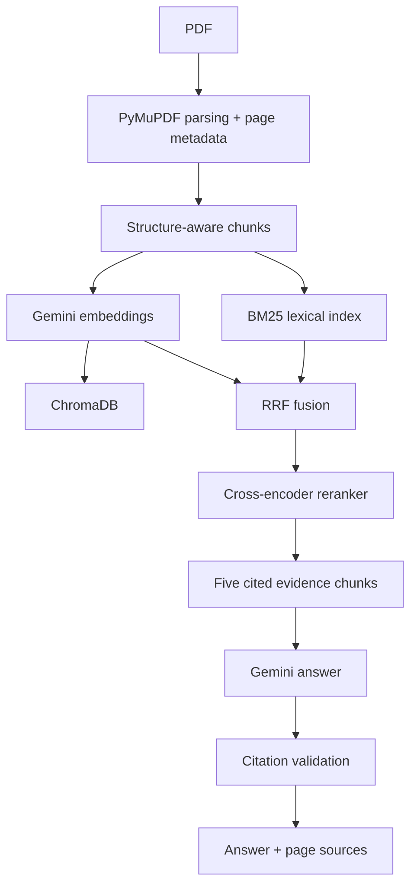

# EvidenceRAG

EvidenceRAG is a local PDF question-answering application built to make the complete RAG pipeline inspectable: PDF parsing, structure-aware chunking, Gemini embeddings in ChromaDB, BM25 lexical retrieval, Reciprocal Rank Fusion, cross-encoder reranking, Gemini generation, and citation validation.

## Why hybrid retrieval?

Vector-only retrieval is strong at semantic similarity but can miss exact technical terms, identifiers, abbreviations, numbers, and gene/protein names. BM25 provides a complementary lexical signal. EvidenceRAG fuses their rankings with RRF rather than comparing incompatible raw scores.



## Run locally

```bash
cd evidencerag
python3 -m venv .venv && source .venv/bin/activate
pip install -r requirements.txt
cp .env.example .env
# Add GEMINI_API_KEY to .env for embeddings and generation.
python run.py
```

In another terminal, run `streamlit run frontend/app.py` and open the displayed URL. The API is available at `http://localhost:8000`; Swagger is at `/docs`.

The API supports `POST /documents/upload`, `GET /documents`, `DELETE /documents/{document_id}`, and `POST /query`. Each query response includes dense results, BM25 results, RRF results, reranked evidence, timings, and structured citation validation.

## Configuration

Use `.env` for `GEMINI_API_KEY`, `GEMINI_MODEL`, `EMBEDDING_MODEL`, and `RERANKER_MODEL`. Retrieval top-k values and chunk settings can also be supplied through the UI or request body. Embeddings are created at ingestion time; queries do not recompute document embeddings.

## Testing and evaluation

```bash
cd evidencerag
pytest
python evaluate.py evaluation.json
```

Evaluation data is an array of `{ "question": "...", "relevant_chunk_ids": ["..."] }`; metrics are computed from the indexed collection and are never fabricated.

## Limitations and future work

Scanned PDFs require OCR, and the first startup may download the cross-encoder model. The current store is a local JSON manifest and Chroma collection, appropriate for a local demonstration rather than concurrent production deployment. Future work could add OCR, incremental embedding batches, a durable relational metadata store, and claim-level entailment validation.
